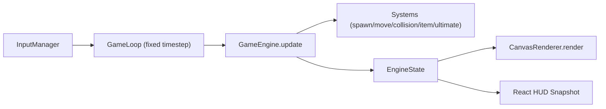
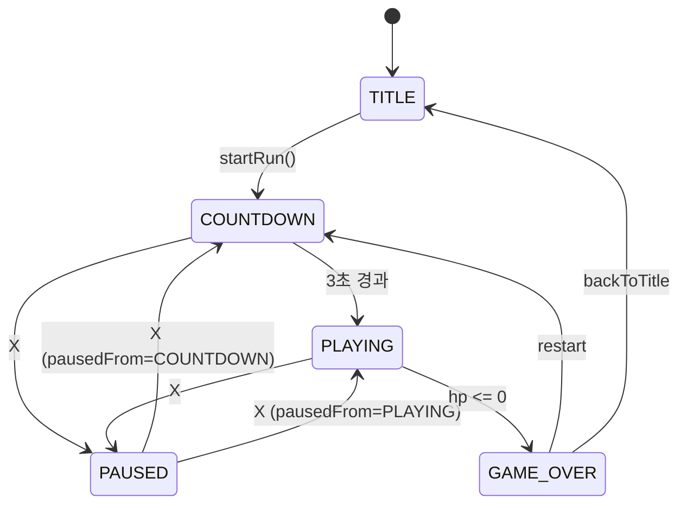

# GAMM: 웹 탄막 회피 게임

React + Vite + TypeScript + Canvas 2D로 구현한 무한 생존형 탄막 회피 게임입니다.

- 조작: 방향키 이동, `Z` 궁극기, `X` 일시정지
- 목적: 탄막을 피하며 생존 점수를 올리고 최고 점수를 갱신
- 핵심 설계: UI(React)와 시뮬레이션(순수 TS 엔진) 분리, 패턴/아이템/궁극기 레지스트리 기반 확장

---

## 1. 기술 스택

- Runtime: Node.js `>=20`
- Frontend: React 18, TypeScript 5, Vite 5
- Rendering: Canvas 2D (직접 렌더링)
- Test: Vitest
- Deployment: Vercel (정적 배포)

---

## 2. 빠른 시작

```bash
npm install
npm run dev
```

### 주요 스크립트

```bash
npm run dev                    # 개발 서버
npm run test                   # 테스트 실행
npm run build                  # 프로덕션 빌드
npm run check                  # test + build
npm run deploy:vercel:preview  # Vercel 프리뷰 배포
npm run deploy:vercel:prod     # Vercel 프로덕션 배포
```

---

## 3. 게임 플레이 규칙

### 입력

- 이동: `ArrowUp`, `ArrowDown`, `ArrowLeft`, `ArrowRight`
- 궁극기: `KeyZ` (키다운 엣지 트리거)
- 일시정지: `KeyX` (토글)

### 화면 상태

- `TITLE`: 타이틀 + 시작 버튼
- `COUNTDOWN`: 3초 카운트다운
- `PLAYING`: 실시간 플레이
- `PAUSED`: 일시정지
- `GAME_OVER`: 점수 결과 + 재시작/타이틀 복귀

### 핵심 수치(기본 설정)

- 월드 크기: `1280x720`
- 플레이어 HP: `100`
- 궁극기 게이지 시작값: `100` (즉시 사용 가능)
- 접촉 피해: `12`
- 피격 무적 시간: `300ms`
- 점수: 초당 `+10`
- 아이템 효과
  - 점수: `+250`
  - 게이지: `+35`
  - 체력: `+20`

### 탄막 패턴

1. `edge-shot`
- 화면 외곽 랜덤 위치에서 플레이어 쪽으로 기본 직선 발사

2. `split-burst-shot`
- 느리게 날아오다가 랜덤 시점에 분열
- 분열 시 다방향 파편 발사
- 폭발 타이밍은 빠른 밴드/느린 밴드로 크게 분산

3. `spiral-seeder-shot`
- 느리게 이동하는 코어 탄막
- 이동 중 일정 주기마다 주변으로 나선형 탄막 방출
- 시간 제한으로 사라지지 않으며, 화면 밖으로 나갈 때 제거

---

## 4. 아키텍처 개요

### 레이어 분리

- **React UI 레이어**
  - 화면 전환, HUD, 버튼 이벤트
  - 위치: `src/app`, `src/ui`
- **게임 엔진 레이어**
  - 상태 머신, 물리/충돌/스폰/아이템/궁극기 처리
  - 위치: `src/game`
- **렌더 레이어**
  - Canvas 2D 렌더링만 담당
  - 위치: `src/game/render/CanvasRenderer.ts`

### 실행 흐름 (하이레벨)



### 상태 전이



---

## 5. 주요 모듈 상세

## 5.1 App/UI

- `src/app/App.tsx`
  - 엔진 생성
  - 게임 루프 시작/정지
  - Canvas 렌더 호출
  - 엔진 스냅샷을 React 상태로 반영
- `src/ui/components/HudOverlay.tsx`
  - HP/게이지/점수/카운트다운/일시정지 오버레이
- `src/ui/screens/*`
  - 타이틀 화면, 게임오버 화면

## 5.2 엔진 코어

- `src/game/engine/GameEngine.ts`
  - 게임 전역 오케스트레이션
  - 패턴 선택 및 시스템 호출 순서 관리
  - 궁극기 이펙트 상태(`ultimateFx`) 관리
  - 최고점 저장 연동

- `src/game/engine/GameLoop.ts`
  - `requestAnimationFrame` 기반 루프
  - 고정 timestep(기본 60Hz) 시뮬레이션
  - 탭 비활성 후 과도한 업데이트 방지(`frameMs <= 100`)

## 5.3 시스템

- `DifficultySystem`: 시간에 따른 티어 선택
- `SpawnSystem`: 탄막 스폰 타이머 + 패턴 실행
- `MovementSystem`: 플레이어/탄막/아이템 이동, 월드 밖 정리
- `BurstSystem`:
  - `split-on-timeout`: 시한 분열
  - `spiral-emitter`: 주기적 나선 방출
- `CollisionSystem`: 플레이어-탄막/아이템 충돌
- `ItemSystem`: 가중치 기반 아이템 선택/스폰, 게이지 clamp
- `UltimateSystem`: 게이지 체크 + 화면 탄막 삭제

## 5.4 렌더링

- `src/game/render/CanvasRenderer.ts`
  - 배경/그리드/오브젝트 렌더
  - 패턴 타입별 탄막 색상 구분
  - 궁극기 이펙트
    - 화면 플래시
    - 쇼크웨이브(원형 파동)
    - 카메라 쉐이크

## 5.5 콘텐츠 레지스트리

- `src/game/content/registry.ts`
  - 캐릭터/궁극기/패턴/아이템 등록/조회
- `src/game/content/defaultContent.ts`
  - 기본 콘텐츠를 한 곳에서 등록
- `src/game/content/types.ts`
  - 확장 포인트 인터페이스 정의

---

## 6. 엔진 업데이트 순서 (PLAYING)

`GameEngine.updatePlaying()` 기준:

1. 경과 시간/점수 누적
2. 궁극기 시각효과 시간 갱신
3. 난이도 티어 선택
4. 플레이어 이동
5. 궁극기 입력 처리 (`Z`)
6. 탄막 스폰 (패턴 선택 포함)
7. 아이템 스폰
8. 탄막 이동
9. 탄막 행동 처리 (분열/나선 방출)
10. 아이템 이동
11. 월드 밖 객체 정리
12. 충돌 처리
13. 아이템 획득 효과 적용
14. 사망 판정 및 게임오버 처리

이 순서를 유지하면 입력 반응성/난이도/충돌 결과가 안정적으로 유지됩니다.

---

## 7. 확장 가이드

## 7.1 새 탄막 패턴 추가

1. `src/game/content/patterns/`에 패턴 파일 생성
2. `BulletPatternDefinition` 구현
3. `src/game/content/defaultContent.ts`에서 등록
4. 필요하면 `gameConfig.patterns`에 출현 확률/해금 타이밍 추가
5. `GameEngine.pickActivePatternId()`에 선택 로직 반영

핵심 포인트:
- 패턴 함수는 `spawn(ctx, difficulty)`로 `BulletSpawn[]`를 반환
- 복합 행동이 필요하면 `behavior` 메타를 붙이고 `BurstSystem`에서 처리

## 7.2 새 탄막 행동 타입 추가

1. `src/game/entities/types.ts`에 `BulletBehavior` 유니온 타입 확장
2. `SpawnSystem`이 메타를 보존하도록 유지
3. `BurstSystem`(또는 새 시스템)에서 행동 처리
4. `CanvasRenderer`에서 시각 구분 추가(선택)

## 7.3 캐릭터 추가

1. `CharacterDefinition` 작성
2. 레지스트리에 등록
3. 시작 캐릭터 선택 로직 추가 (현재는 `default-runner` 고정)

## 7.4 궁극기 추가

1. `UltimateDefinition` 작성
2. `activate(ctx)`에서 효과 구현
3. 레지스트리에 등록
4. 캐릭터의 `ultimateId` 연결

## 7.5 아이템 추가

1. `ItemDefinition` 작성
2. `apply`와 `weight` 구현
3. 레지스트리에 등록
4. 필요 시 HUD/렌더링 색상 추가

---

## 8. 밸런스 튜닝 포인트

주요 수치는 `src/game/config/gameConfig.ts`에 집중되어 있습니다.

- 난이도 티어: `difficultyTiers`
  - 탄속, 스폰 간격, 동시 최대 탄막 수
- 패턴 출현 확률/해금 시간: `patterns`
- 전투 기본값: `combat`
- 아이템 주기/효과/가중치: `items`
- 점수 증가율: `score.pointsPerSecond`

튜닝 팁:
- 난이도 급상승을 줄이려면 `spawnIntervalMs`를 먼저 완화
- 복합 패턴 체감이 과하면 `patterns.*Chance*`를 낮춰 출현 빈도 조절
- 성능 여유를 확보하려면 티어별 `maxBullets`를 우선 조정

---

## 9. 테스트 전략

현재 테스트는 순수 로직 중심으로 구성되어 있습니다.

- 상태 전이: `src/game/state/ScreenStateMachine.test.ts`
- 난이도 선택: `src/game/systems/DifficultySystem.test.ts`
- 궁극기 동작: `src/game/systems/UltimateSystem.test.ts`
- 충돌/피격 무적: `src/game/systems/CollisionSystem.test.ts`
- 분열/나선 행동: `src/game/systems/BurstSystem.test.ts`

권장 확장 테스트:
- 패턴별 스폰 통계 테스트(확률 검증)
- 고정 seed 기반 리플레이 일관성 테스트
- `GameEngine.updatePlaying` 통합 테스트

---

## 10. 성능 및 안정성 메모

- 고정 timestep으로 프레임 드랍 시 물리 안정성 확보
- 월드 밖 객체 정리로 메모리/렌더 비용 제어
- 탄막 행동 처리 시 `maxBullets` cap 유지
- `localStorage` 접근은 브라우저 환경 확인 후 수행

---

## 11. 배포

Vercel 배포 절차는 별도 문서 참고:

- `DEPLOY_VERCEL.md`

`vercel.json`은 이미 포함되어 있으며, 기본 출력 디렉터리는 `dist`입니다.

---

## 12. 프로젝트 구조

```text
src/
  app/
    App.tsx
  game/
    config/
    content/
      characters/
      items/
      patterns/
      ultimates/
      registry.ts
      types.ts
    engine/
      GameEngine.ts
      GameLoop.ts
      engineState.ts
    entities/
      types.ts
    input/
      InputManager.ts
    render/
      CanvasRenderer.ts
    state/
      ScreenStateMachine.ts
    systems/
      BurstSystem.ts
      CollisionSystem.ts
      DifficultySystem.ts
      ItemSystem.ts
      MovementSystem.ts
      SpawnSystem.ts
      UltimateSystem.ts
    utils/
      rng.ts
      vector.ts
  storage/
    scoreStorage.ts
  ui/
    components/
    screens/
```

---

## 13. 개발 원칙

- UI와 게임 시뮬레이션 책임 분리
- 규칙/밸런스는 설정 파일로 집중
- 기능 추가는 레지스트리 + 시스템 확장으로 처리
- 테스트 가능한 순수 함수 우선

이 원칙을 유지하면 캐릭터/궁극기/패턴/아이템 요구사항 변경에 빠르게 대응할 수 있습니다.
